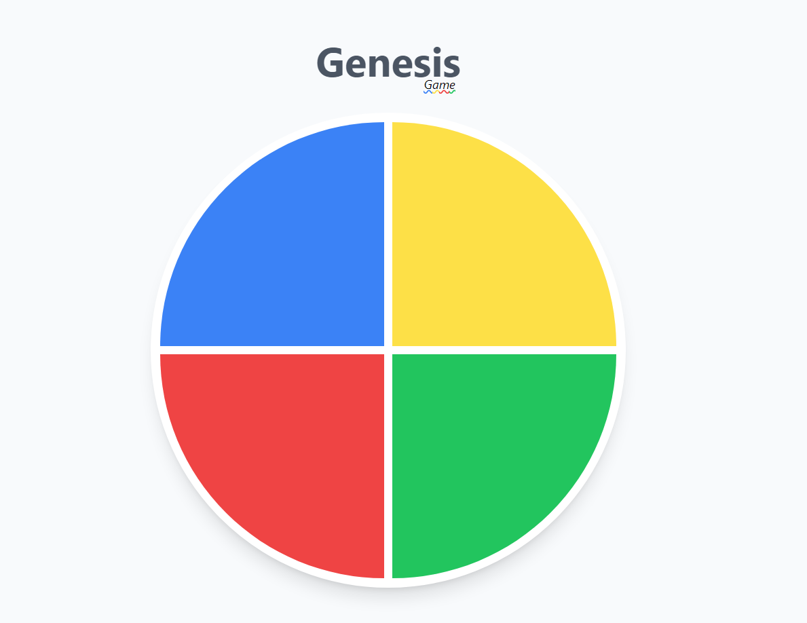

# Game - Genesis 🎮

> 🕹 Um mini jogo de memória baseado no game popular _Genius_, em uma página divertida e responsiva, desenvolvida sob o conceito ***mobile-first***.
🚀 [Acesse o site aqui!](https://allbertuu.github.io/game-genesis/) 🚀  

## ⭐ Projeto
***Preview***  

### ⚙ Ajustes e melhorias

O projeto ainda está em desenvolvimento e as próximas atualizações serão voltadas nas seguintes tarefas:

- [x] Dificuldade dinâmica
- [x] Área dinâmica com as cores restantes para ganhar
- [x] Controle do clique do usuário
- [ ] Área de recordes pessoais e públicos (ranking)

## 💻 Tecnologias usadas
- JavaScript ES6
- HTML
- CSS
- TailwindCSS

## 💡 Idealizado e feito por

<table>
  <tr>
    <td align="center">
      <a href="https://www.github.com/allbertuu">
         
        
          <b>Alberto Albuquerque</b>
        
      </a>
    </td>
  </tr>
</table>
